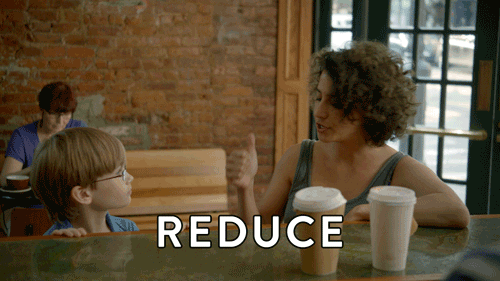
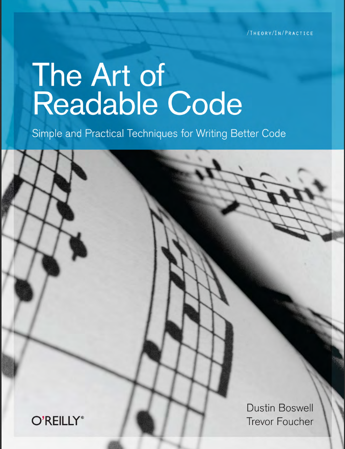
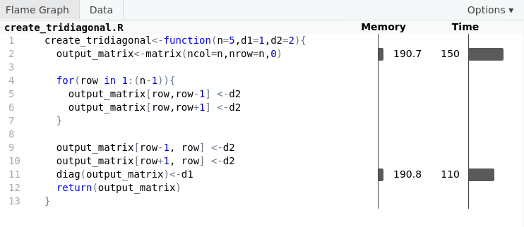
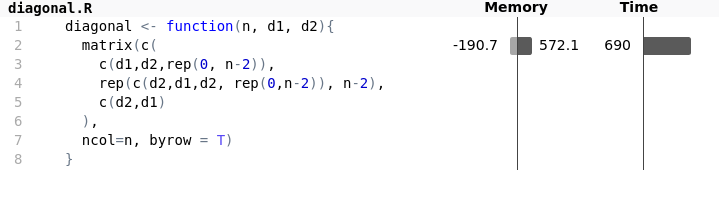
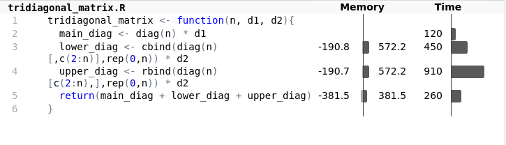
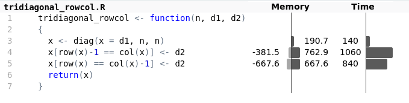
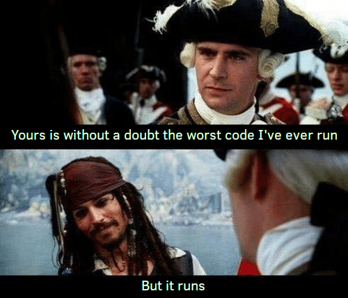

class: center, middle

```{r setup, include=FALSE}
options(htmltools.dir.version = FALSE)
library(knitr)
```

```{r xaringan-themer, include=FALSE}
library(xaringanthemer)
duo_accent(primary_color = "#1b5f71", 
           secondary_color = "#e14337",
           inverse_header_color = "#FFFFFF")
# solarized_dark(
#   code_font_family = "Fira Code",
#   code_font_url    = "https://cdn.rawgit.com/tonsky/FiraCode/1.204/distr/fira_code.css"
# )
# mono_accent(
#   base_color = "#004d67",
#   header_font_google = google_font("Muli"),
#   text_font_google   = google_font("Muli", "300", "300i"),
#   code_font_google   = google_font("Droid Mono")
# )
```
# Pero antes, un pequeño avance...

---
class: center, middle
# ... y las presentaciones

---
background-image: url("img/quien_soy.png")
background-size: cover

---
class: inverse, center, middle
# I. The art of reusable code


---
# Code that you can reuse is code you don't need to write again!

Reusable code is:

- Easy to understand
- Easy to share
- Easy to adapt

---
# Easy to understand

- Use proper names
- Comment your code!
- Use a code style

> Does making code efficient conflict with wanting to make code easy to understand? Making your code easy to understand often leads to code that is well architected and easy to test.


---
# The Fundamental Theorem of Readability

> Code should be written to minimize the time it would take for someone else to understand it.
>
> --- The art of reusable code

--

Someone else can be yourself after a while!

--

.center[
```{r out.width = "40%", echo = FALSE}
 
```
]

---
class: inverse, center, middle
# II. Code style


---
# Naming objects

```{r}
function1 <- function(v){
  retval <- 0
  for (i in 1:length(v)){
    retval = retval + v[i]*v[i]
  }
  return(sqrt(retval))
}
```

What does this function do?

--

The names function1 and retval doesn’t pack much information. Instead, use a name that describes
the variable’s value.!

---
# Naming objects

```{r}
euclidean_norm <- function(v){
  sum_squares <- 0
  for (i in 1:length(v)){
    sum_squares = sum_squares + v[i]*v[i]
  }
  return(sqrt(sum_squares))
}
```

--
## This is not about speed yet!

---
# Coding styles

- A good recommendation is to use a code style. 
- This will make your code easier to understand and reproduce
- And also freeing your mind about many naming decisions, so you can focus on the analysis.

> Good coding style is like correct punctuation: you can manage without it, butitsuremakesthingseasiertoread.

.footnote[
[1] https://style.tidyverse.org/
]

---
# Coding styles

Two of the most used R coding styles:

- The tidyverse style guide [https://style.tidyverse.org/](https://style.tidyverse.org/)
- The Google’s R Style Guide [https://google.github.io/styleguide/Rguide.html](https://google.github.io/styleguide/Rguide.html)

Other styles:

- Bioconductor [https://bioconductor.org/developers/how-to/coding-style/](https://bioconductor.org/developers/how-to/coding-style/)
- Jean Fan style [https://jef.works/R-style-guide/](https://jef.works/R-style-guide/)

---
# Coding style

- Names
- Spacing (e.g. x[, 1] x[,1])
- Indenting (e.g. tabs, 2/4 spaces)
- Organization (e.g. loading libraries sequentially load all libraries at the start)
- Documentation(e.g. commented code use comments to record important findings and analysis decisions)

https://beautifyrstats.netlify.com

---
# Some tidyverse recommendations for naming stuff in R

- Variable and function names should use only lowercase letters, numbers, and `_`. 
- Use underscores (`_`) (so called snake case) to separate words within a name. 

```{r, eval = FALSE}
# Good
day_one
day_1

# Bad
DayOne
dayone
```

---
# Some tidyverse recommendations for naming stuff in R

Generally, variable names should be nouns and function names should be verbs. 
Strive for names that are concise and meaningful (this is not easy!).

```{r, eval = FALSE}
# Good
day_one

# Bad
first_day_of_the_month
djm1
```

---
# Some tidyverse recommendations for naming stuff in R

Where possible, avoid re-using names of common functions and variables. This will cause confusion for the readers of your code.

```{r, eval = FALSE}
# Bad
T <- FALSE
c <- 10
mean <- function(x) sum(x)
```

---
# Some tidyverse recommendations for naming stuff in R

- R has strict rules about what constitutes a valid name. 
- A syntactic name must consist of letters, digits, `.` and `_` but can’t begin with `_` or a digit. 
- Additionally, you can’t use any of the reserved words like TRUE, NULL, if, and function (see the complete list in ?Reserved). 
- A name that doesn’t follow these rules is a non-syntactic name; if you try to use them, you’ll get an error:

```{r, eval = FALSE}
_abc <- 1
if <- 10
```


It’s possible to override these rules and use any name, i.e., any sequence of characters, by surrounding it with backticks:

```{r}
`_abc` <- 1
`if` <- 10
```

---
# Two tricks for changing names

- In your code: The "Rename in Scope" function of RStudio

```{r}
function1 <- function(v){
  retval <- 0
  for (i in 1:length(v)){
    retval = retval + v[i]*v[i]
  }
  return(sqrt(retval))
}
```

---
# Two tricks for changing names

- In your code: The "Rename in Scope" function of RStudio

```{r}
function1 <- function(v){
  retval <- 0
  for (i in 1:length(v)){
    retval = retval + v[i]*v[i]
  }
  return(sqrt(retval))
}
```

---
# Two tricks for changing names

- In your data: The janitor package clean_names() and make_clean_names()

```{r, message=FALSE}
library(janitor)
ugly_names <- c("var 1", "var 20%", "var...3", "vár 4")
make_clean_names(ugly_names)
```

---
# A harder example, what this function does?

```{r}
function1<-function(p1=5,p2=1,p3=2){output<-matrix(ncol=p1,nrow=p1,0)
for(row in 1:(p1-1)){output[row,row-1]=p3
output[row,row+1]=p3}
output[row-1,row]=p3
output[row+1,row]=p3
diag(output)=p2
return(output)
}
```

--
```{r}
function1(5,4,3)
```

---
# Good names are not enough

```{r, cache = TRUE}
create_tridiagonal<-function(n=5,d1=1,d2=2){output_matrix<-matrix(ncol=n,nrow=n,0)
for(row in 1:(n-1)){output_matrix[row,row-1]=d2
output_matrix[row,row+1]=d2}
output_matrix[row-1,row]=d2
output_matrix[row+1,row]=d2
diag(output_matrix)=d1
return(output_matrix)
}
```

--
```{r, cache = TRUE}
create_tridiagonal(5,4,3)
```

---
#More info about the tidyverse coding style

https://style.tidyverse.org/

Two R packages support this style guide:

  - styler allows you to interactively restyle selected text, files, or entire projects. It includes an RStudio add-in, the easiest way to re-style existing code.
  - lintr performs automated checks to confirm that you conform to the style guide.

---
# Demo of the styler package

```{r}
create_tridiagonal<-function(n=5,d1=1,d2=2){output_matrix<-matrix(ncol=n,nrow=n,0)
for(row in 1:(n-1)){output_matrix[row,row-1]=d2
output_matrix[row,row+1]=d2}
output_matrix[row-1,row]=d2
output_matrix[row+1,row]=d2
diag(output_matrix)=d1
return(output_matrix)
}
```

---
# Demo of the lintr package

```{r, eval = FALSE}
lintr::lint("lynter_example.R")
```

---
# Ahora vosotros

El problema previo fue originalmente propuesto por Juan Jose Gibaja y Carlos Gil Bellosta en su segunda edicion del "Curso de R basico":

**Create a function to create a tridiagonal matrix, with input parameters:**

- `n` (the dimension of the matrix should be `n x n`)
- `d1` (the diagonal of the matrix should be filled with this value)
- `d2` (the upper an lower diagonal of the matrix should be filled with this value)

So, for example, `create_tridiagonal(3,1,2)` should return:
```{r, echo=FALSE}
a <- matrix(c(1,2,0,2,1,2,0,2,1), nrow=3)
a
```

```{r, echo = FALSE}
library(countdown)
countdown(minutes = 15, seconds = 0)
```

---
class: inverse, center, middle

# III. Measuring the efficiency of your code


---
# Measuring efficiency

- Readability is a subjective measure, and we already cover it.
- Most of the time you will easily know if your code is working or not.
- Test your code! (shinytest, testthat...)

But today we will focus on:

- Memory
- Time


---
# Memory 

By default in R you need to limit your analysis to RAM memory, but what to do if you are short of memory?

.pull-left[
- Buy more RAM
- Ask your company/university/city/country permission to use more powerful servers. (e.g. RES - Red Española de Supercomputación https://www.bsc.es/res-intranet)
- Use cloud companies
- Use Big data packages (bigmemory, Matrix)
]
--
.pull-right[
OR
- Optimize your code so some memory intensive calculations are not needed
]


---
# How to measure memory in R

```{r, cache = TRUE}
a <- rnorm(1000000)
print(object.size(a), units = "Mb")
library(pryr)
object_size(a)
b <- a
object_size(b)
```
What will be the result of `object.size(a,b)` ?

---
# How to measure memory in R

```{r, cache = TRUE}
object_size(a,b)
b[1] <- 0
object_size(a,b)
mem_used()
mem_change(x <- 1:1e6)
mem_change(rm(x))
```

---
# Garbage collector

Does some of you use the gc() function?

--


---
# How fast is your computer?

```{r, eval = FALSE}
#install.packages("benchmarkme")
library("benchmarkme")
```

Things you can check with the benchmarkme package:

The package has a few useful functions for extracting system specs:

- RAM: get_ram()
- CPUs: get_cpu()
- BLAS library: get_linear_algebra()
- Is byte compiling enabled: get_byte_compiler()
- General platform info: get_platform_info()
- R version: get_r_version()

Try yours!

---
# Perform tests and compare with other machines

```{r, eval=FALSE}
res <- benchmark_std(runs = 3)
rank_results(res)
plot(res)
```

---
# Measuring time

- As usual, there are several ways to measure execution time of your code.
- The R base provide with Sys.time() and system.time()

```{r, cache = TRUE}
start_time <- Sys.time()
Sys.sleep(3)
end_time <- Sys.time()
end_time - start_time
system.time({ Sys.sleep(3)})
```

- "User CPU time” gives the CPU time spent by the current process and “system CPU time” gives the CPU time spent by the kernel (the operating system) on behalf of the current process. (Post by William Dunlap)

---
# Another alternatives for measuring time

The tictoc package may be familar for those coming from Matlab world

```{r, cache = TRUE}
library(tictoc)
tic("sleeping")
Sys.sleep(3)
toc()
```

---
# Measuring the time: Benchmark packages

- The bench package
```{r, cache = TRUE}
x <- runif(100)
(lb <- bench::mark(
  sqrt(x),
  x ^ 0.5
))
```

---
# Measuring the time: Benchmark packages
- The microbenchmark package
```{r, cache = TRUE}
library(microbenchmark)

x <- runif(100)
microbenchmark(
  sqrt(x),
  x ^ 0.5
)
```

---
# Measuring the time: Benchmark packages

- And the rbenchmark package
```{r, cache = TRUE}
library(rbenchmark)

x <- runif(100)
benchmark(
  "method1" = sqrt(x),
  "method2" = x ^ 0.5
)
```

---
# Your turn again

- Compare your solution for the tridiagonal matrix problem with the one we presented before (file create_tridiagonal.R). 

- Benchmark them by generating a tridiagonal matrix of dimension 5000x5000

---
class: inverse, center, middle

# IV. How to improve?


---
# Profiling

- In case we want to find out which part of our code is the most time consuming we can use profiling tools. - Again, there are many options available but I recommend you the profvis package
- You can profile a piece of code by using

```{r, eval = FALSE}
profvis({
  #The code to be evaluated
})
```
## Two tips
- If the code is too fast, there is nothing to profile, and it will not run!
- If you want to profile a single function, save that function in an .R file and profile it with:

```{r, eval = FALSE}
source("my_function.R")
profvis({
  myfunction(x)
})
```

---
# What are the two main time consuming parts of our "create_tridiagonal" function?

```{r}
create_tridiagonal <- function(n = 5, d1 = 1, d2 = 2) {
  output_matrix <- matrix(ncol = n, nrow = n, 0)
  for (row in 1:(n - 1)) {
    output_matrix[row, row - 1] <- d2
    output_matrix[row, row + 1] <- d2
  }
  output_matrix[row - 1, row] <- d2
  output_matrix[row + 1, row] <- d2
  diag(output_matrix) <- d1
  return(output_matrix)
}
```

```{r, eval = FALSE}
source("create_tridiagonal.R")
profvis::profvis(create_tridiagonal(5000,1,-1))
```

---
# What are the two main time consuming parts of our "create_tridiagonal" function?



---
# Three things to improve

- Create the matrix() and assign the diag() in one step
- Inside the for() cycle fill the upper and low diagonal in one step 

```{r, cache = TRUE}
create_tridiagonal2 <- function(n = 5, d1 = 1, d2 = 2) {
  #We create the matrix and assign the diagonal in one step
  output_matrix <- diag(d1, n)
  
  #"row" is a function in base r, so I prefer "i" as counter
  # We put the d2 value in one step instead of 2
  for (i in 1:(n - 1)) {
    output_matrix[i, c(i - 1, i + 1)] <- d2
  }
  output_matrix[c(i - 1, i + 1), i] <- d2
  return(output_matrix)
}
```

---
#Now let's compare
```{r, cache = TRUE}
library(rbenchmark)
benchmark(m1 <- create_tridiagonal(5000,1,-1),
          m2 <- create_tridiagonal2(5000,1,-1),
          replications = 3)
```

---
# Second approach: We create the vector of elements and shape it into a matrix
```{r, cache = TRUE}
diagonal <- function(n, d1, d2){
  matrix(c(
    c(d1,d2,rep(0, n-2)),
    rep(c(d2,d1,d2, rep(0,n-2)), n-2),
    c(d2,d1)
  ), 
  ncol=n, byrow = T)
}
```

---
# How to improve it?
```{r, cache = TRUE, eval = FALSE}
source("diagonal.R")
profvis::profvis(diagonal(5000,1,-1))
#Not very informative, everything is just one function: matrix()
```


---
#Things to improve:

- Reduce the number of calls for rep(). Currently 3
- Use rep.int which is faster
```{r}
diagonal2 <- function(n, d1, d2){
  #Notice that we now create only a short version of the vector, 
  #the matrix() function is filling it out
  #But it will raise a warning!
  matrix(c(d1, d2, rep.int(0,n-2), d2), nrow = n, ncol = n)
  }
```

---
#Now let's compare
```{r, cache = TRUE}
benchmark(m3 <- diagonal(5000,1,-1),
          m4 <- diagonal2(5000,1,-1),
          replications = 3)
```


### Around 6 times faster!

---
# Third approach: Sum of three matrices, one for main diagonal, one for lower, one for upper.

```{r, cache = TRUE}
tridiagonal_matrix <- function(n, d1, d2){
  main_diag <- diag(n) * d1
  lower_diag <- cbind(diag(n)[,c(2:n)],rep(0,n)) * d2
  upper_diag <- rbind(diag(n)[c(2:n),],rep(0,n)) * d2
  return(main_diag + lower_diag + upper_diag)
}
```

---
# How to improve it?
```{r, cache = TRUE, eval= FALSE}
source("tridiagonal_matrix.R")
profvis::profvis(tridiagonal_matrix(5000,1,-1))
```


---
# Things to change

- Three calls to diag()
- Two calls to rep()

```{r, cache = TRUE}
tridiagonal_matrix2 <- function(n, d1, d2){
  base_diag <- diag(n)
  main_diag <- base_diag * d1
  lower_diag <- cbind(base_diag[,-1],rep.int(0,n)) * d2
  upper_diag <- t(lower_diag)
  return(main_diag + lower_diag + upper_diag)
}
```

---
# Let's compare
```{r, cache = TRUE}
benchmark(m5 <- tridiagonal_matrix(5000,1,-1),
          m6 <- tridiagonal_matrix2(5000,1,-1),
          replications = 3)
```

---
# Fourth approach: Rcpp
```{r, cache = TRUE}
Rcpp::cppFunction('NumericMatrix create_tridiagonal_sb(int n, int d1, int d2){
NumericMatrix m(n, n);

for (int i = 0; i < n; i++)
for (int j = 0; j < n; j++)
m(i, j) = 0;

for (int i = 0; i < n; i++)
m(i, i) = d1;

for (int i = 0; i < (n - 1); i++){
m(i, i + 1) = d2;
m(i + 1, i) = d2;
}

return m;
}')
```

---
# Things to improve

- Too many for cycles
```{r, cache = TRUE}
Rcpp::cppFunction('NumericMatrix create_tridiagonal_sb2(int n, int d1, int d2){
NumericMatrix m(n, n);

for (int i = 0; i < (n - 1); i++){
m(i, i) = d1;
m(i, i + 1) = d2;
m(i + 1, i) = d2;
}

m(n-1, n-1) = d1;

return m;
}')
```

---
# Let's compare
```{r, cache = TRUE}
benchmark(m7 <- create_tridiagonal_sb(5000,1,-1),
          m8 <- create_tridiagonal_sb2(5000,1,-1),
          replications = 3)
```

---
# Fifth approach, use of row() and col() functions

```{r, cache = TRUE}
tridiagonal_piotr_opiela <- function(n, d1, d2)
{
  x <- diag(x = d1, n, n) 
  x[row(x)-1 == col(x)] <- d2
  x[row(x) == col(x)-1] <- d2
  return(x)
}
```

---
# How to improve it?

```{r, cache = TRUE, eval=FALSE}
source("tridiagonal_piotr_opiela.R")
profvis::profvis(tridiagonal_piotr_opiela(5000,1,-1))
```

---
#Things to improve

- Assign the d2 diagonal in one step

```{r, cache = TRUE}
tridiagonal_piotr_opiela2 <- function(n, d1, d2)
{
  x <- diag(d1, n) 
  # x[row(x)-1 == col(x)] <- d2
  # x[row(x) == col(x)-1] <- d2
  x[abs(row(x) - col(x)) == 1] <- d2
  return(x)
}
```

---
# Let's compare

```{r, cache = TRUE}
benchmark(m9 <- tridiagonal_piotr_opiela(5000,1,-1),
          m10 <- tridiagonal_piotr_opiela2(5000,1,-1),
          replications = 3)

```

---
# Original functions comparison

```{r, cache = TRUE}
benchmark(create_tridiagonal(5000,1,-1),
          diagonal(5000,1,-1),
          tridiagonal_matrix(5000,1,-1),
          create_tridiagonal_sb(5000,1,-1),
          tridiagonal_piotr_opiela(5000,1,-1),
          replications = 3
          )
```

---
# Original and new functions comparison

```{r, echo=FALSE, warning=FALSE, cache=TRUE}
#All together

benchmark(create_tridiagonal(5000,1,-1),
          diagonal(5000,1,-1),
          tridiagonal_matrix(5000,1,-1),
          create_tridiagonal_sb(5000,1,-1),
          tridiagonal_piotr_opiela(5000,1,-1),
          create_tridiagonal2(5000,1,-1),
          diagonal2(5000,1,-1),
          tridiagonal_matrix2(5000,1,-1),
          create_tridiagonal_sb2(5000,1,-1),
          tridiagonal_piotr_opiela2(5000,1,-1),
          replications = 3, order = "elapsed"
)
```

---
# Exercise

Generate 100 matrices where n = 500, and d1, and d2 are predefined random integers between -10 and 10:

```{r}
d1_vector <- sample(-10:10, 100, replace = T)
d2_vector <- sample(-10:10, 100, replace = T)
```

---
# Conclusions




---
class: inverse, middle, center

# Thank you!

## Keep in touch:
## adalvarez@gmail.com / adolfo.alvarez@analyx.com
## adolfoalvarez.cl
## Twitter: @adolfoalvarez
